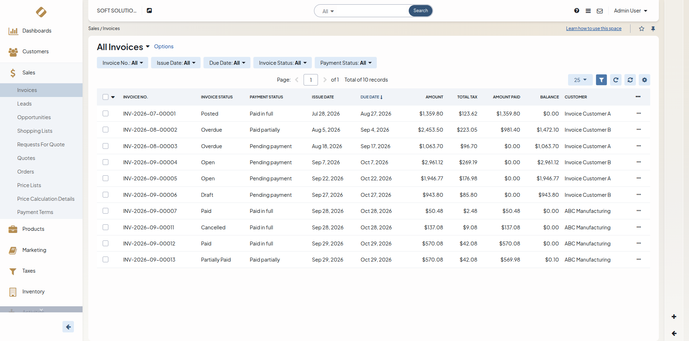
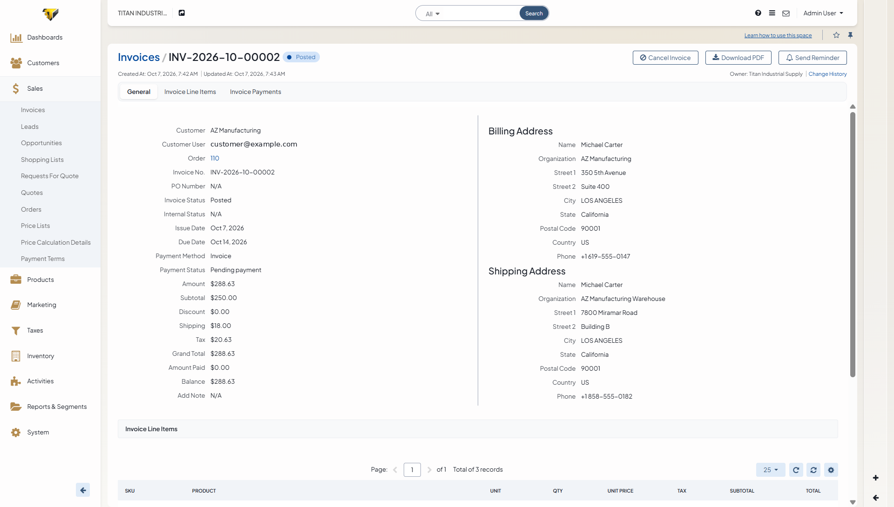
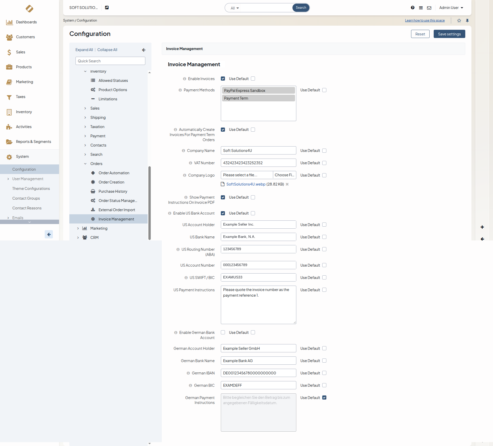
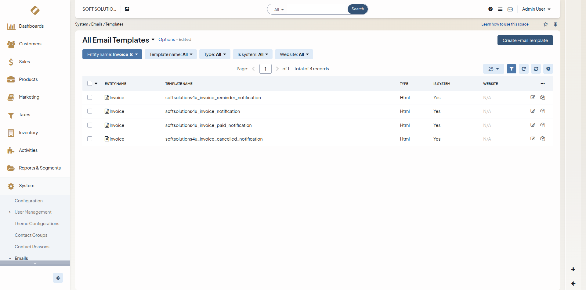
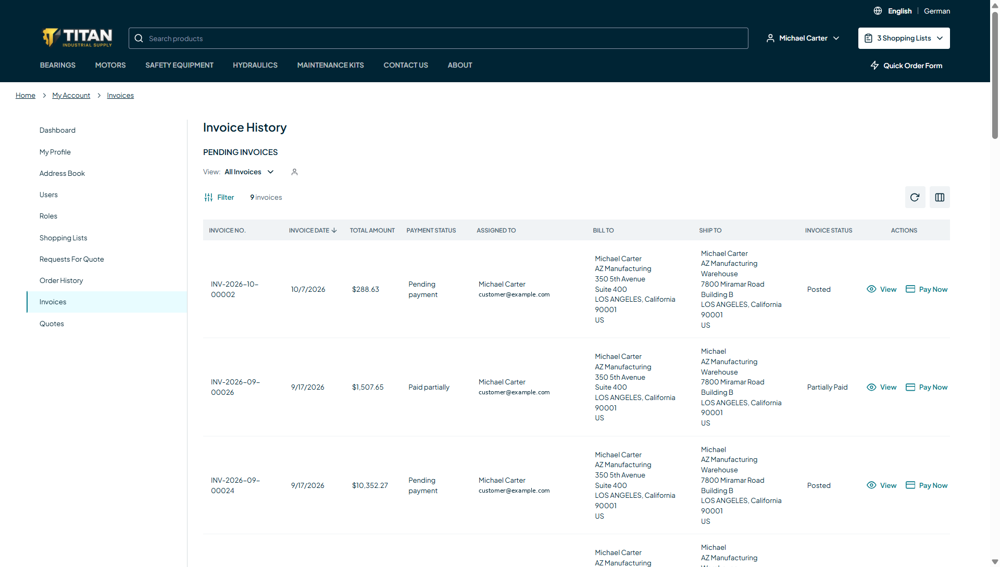
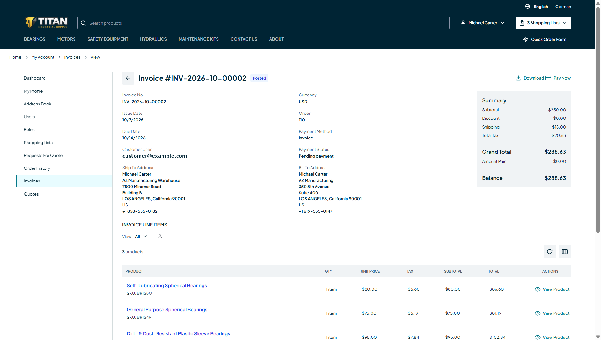
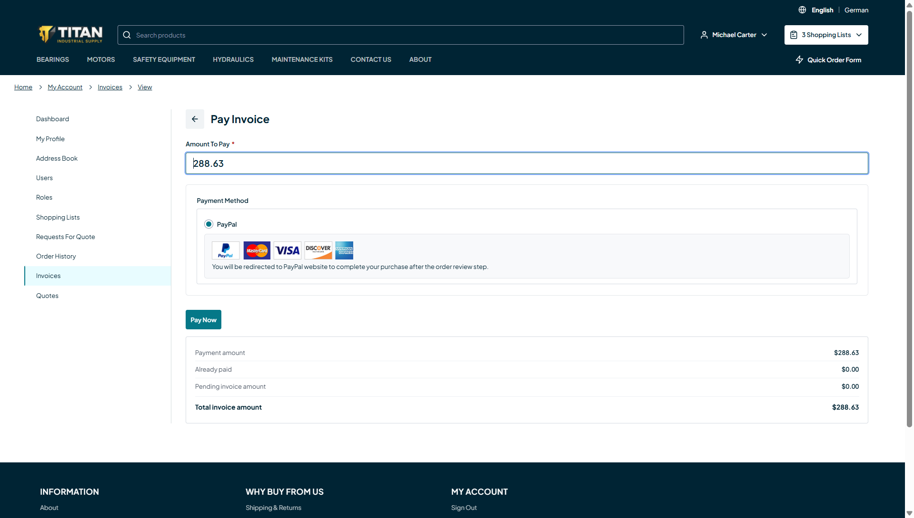

# OroCommerce Invoice

**Invoice management for OroCommerce 7.0 by [SoftSolutions4U](https://www.softsolutions4u.com/).**

Create invoices from orders, send them to customers as PDF invoices, track payments, and let customers view and pay their invoices in the storefront. The package is a single self-contained bundle. It does not modify or override any OroCommerce core files or templates.

| | |
| --- | --- |
| Package | `softsolutions4u/orocommerce-invoice` |
| Bundle | `SoftSolutions4U\Bundle\InvoiceBundle\SoftSolutions4UInvoiceBundle` |
| License | [GPL-3.0-only](LICENSE) |

## Features

**Backoffice**

- Invoice list under *Sales → Invoices* with invoice status and payment status filters.
- Create, view and edit invoices with line items, taxes, discounts, shipping and totals. Draft invoices without payments can be deleted.
- **Create Invoice** button and **Invoices** tab on the order page.
- Invoice lifecycle: Draft → Posted → Open → Partially Paid / Overdue → Paid, plus Cancelled.
- Post, cancel, send payment reminders and send payment confirmations.
- PDF preview and download with your company name, logo and VAT number.
- Payments taken on an order are applied to its invoices automatically.
- Optional automatic invoice creation for *Payment Term* orders.
- **Offline payment confirmation:** a storefront payment made with an offline method (*Payment Term* or *Money Order*) is stored as *awaiting confirmation* and does not change the invoice balance. An administrator uses **Confirm Payment** on the invoice page (permission *Confirm Payment*) to apply it once the money has arrived.
- Posted and open invoices are marked *Overdue* automatically after the due date. Part-paid invoices keep *Partially Paid*.
- Role-based permissions for every action.

**Storefront**

- *My Account → Invoices* with filtering and sorting.
- Invoice detail page and PDF download.
- Online payment of the full or a partial balance.
- Bank-transfer details with a unique payment reference per invoice.

**Emails** (English and German)

- New invoice, payment reminder, payment confirmation, invoice cancelled.

## Compatibility

| Component | Version |
| --- | --- |
| OroCommerce (Community or Enterprise Edition) | 7.0.x |
| PHP | 8.5 |
| Symfony | 7.4 (provided by OroCommerce) |

## Installation

Run these commands from the root of your OroCommerce application:

```bash
composer require softsolutions4u/orocommerce-invoice
php bin/console oro:platform:update --force
php bin/console oro:assets:install
```

The bundle registers itself automatically, so you do not need to edit the kernel. `oro:platform:update` creates the database tables and loads the email templates and translations. `oro:assets:install` publishes the bundle's back-office and storefront assets.

### Installation verification

After installing the bundle, complete the following steps to check that the installation was successful.

**1. Run the database migration**

Run `oro:platform:update --force` before anything else. The bundle's database tables must exist before you load the demo data fixtures. If they do not, the demo data command fails with:

```
relation "softsolutions4u_invoice" does not exist
```

```bash
php bin/console oro:platform:update --force
```

**2. Check the database tables**

Check that the bundle's tables have been created:

```bash
psql -d <database> -c '\dt *softsolutions4u_invoice*'
```

Five tables should be listed: `softsolutions4u_invoice`, `softsolutions4u_invoice_line_item`, `softsolutions4u_invoice_payment`, `softsolutions4u_invoice_payment_line_item` and `softsolutions4u_invoice_sequence`.

**3. Check the Invoices page**

Log in to the OroCommerce back-office and go to **Sales → Invoices**. The page should load without errors.

## Configuration

Open **System → Configuration → Commerce → Orders → Invoice Management**. You can override the settings per organization and per website.

| Setting | Default | Description |
| --- | --- | --- |
| Enable Invoices | Yes | Turns the invoice feature on or off. |
| Payment Methods | *(all)* | Payment methods customers can use to pay invoices online. |
| Company name / VAT number / logo | *(empty)* | Seller details printed on the invoice PDF. |
| Show bank details | Yes | Shows bank-transfer details. Nothing is shown until an account is filled in. |
| US bank account | *(empty)* | Used for USD invoices. |
| SEPA bank account | *(empty)* | Used for EUR invoices. |
| Auto-create invoices for Payment Term orders | No | Creates an invoice when an order is placed with Payment Term. |

**Permissions.** Grant admin permissions in *System → User Management → Roles* (category *Invoice*). Grant storefront access in *Customers → Customer User Roles* (*View Invoices*).

**Email templates.** Edit the templates in *System → Emails → Templates*; search for `softsolutions4u_invoice`.

**Offline payment methods.** Invoice payments made with *Payment Term* or *Money Order* wait for an administrator to confirm them. To change the list, override this parameter in your application's `config/config.yml` (values are payment method identifier prefixes):

```yaml
parameters:
    softsolutions4u_invoice.offline_payment_method_prefixes: [payment_term, money_order]
```

**Sending emails in the background.** Invoice emails are sent while the request runs, so the page can confirm whether an email went out. To send them in the background instead, route Symfony Mailer through Messenger in your application (for example `framework.mailer.message_bus` with an async transport); no change to this bundle is needed.

## Usage

1. Open an order in *Sales → Orders* and click **Create Invoice**. The draft is created and a link to it is shown on the order page.
2. Review the draft invoice and click **Post**. The customer receives the invoice email.
3. The customer opens *My Account → Invoices* and pays online or by bank transfer.
4. Payments update the balance and status automatically.

## Demo Data Fixtures

For development and testing only. Do not run this in production.

### Before you load the demo data: create two customers

The demo invoices are assigned to two customers, which the bundle does not create. Create them first in the back-office under **Customers → Customers → Create Customer**:

| Customer name | Used for |
| --- | --- |
| `Invoice Customer A` | three demo invoices (paid, overdue, open) |
| `Invoice Customer B` | three demo invoices (partially paid, open, draft) |

Use exactly these names. If they do not exist, the fixture falls back to the first two customers in the system; if there are fewer than two customers, no demo invoices are created.

To see the demo invoices in the storefront, also add a customer user to each customer (**Customers → Customer Users → Create Customer User**) with a *Buyer* or *Administrator* role, and log in to the storefront as that user.

### Load the demo data

Make sure the bundle's tables exist first (see [Installation verification](#installation-verification)).

```bash
php bin/console oro:migration:data:load --fixtures-type=demo --bundles=SoftSolutions4UInvoiceBundle
```

The command loads:

- six sample invoices in different statuses (paid, partially paid, overdue, open, draft) for the two customers above;
- fictional seller and bank details in *Invoice Management* settings (company name, VAT number, US and German bank accounts) and the demo company logo, so invoices and PDFs show a complete seller block. Settings that already have a value are not changed.

The demo company and bank details are fake. Replace them with your real company and bank details before using the shop for real customers.

## Database migrations

Schema migrations live in `Migrations/Schema`, one directory per version:

```
Migrations/Schema/
├── SoftSolutions4UInvoiceBundleInstaller.php  # fresh installs: builds the current schema (v1_2)
├── v1_0/
│   └── CreateInvoiceTables.php                # invoice, line item, payment and payment line item tables
├── v1_1/
│   └── AddInvoicePaymentConfirmation.php      # pending_confirmation flag and payment transaction foreign key
└── v1_2/
    └── AddInvoiceSequence.php                 # invoice-number sequence table
```

Tables created: `softsolutions4u_invoice`, `softsolutions4u_invoice_line_item`, `softsolutions4u_invoice_payment`, `softsolutions4u_invoice_payment_line_item` and the `softsolutions4u_invoice_sequence` invoice-number counter.

After updating an existing installation, apply the pending migrations:

```bash
php bin/console oro:platform:update --force
```

Data fixtures (email templates, translations and the configuration section rename) are in `Migrations/Data/ORM`, and demo data is in `Migrations/Data/Demo/ORM`.

## Order page integration

The *Invoices* section on the order view and edit pages is added through Oro's `oro_ui.scroll_data.before.order-view` and `oro_ui.scroll_data.before.order-edit` events. The bundle does not replace or copy any OroCommerce template.

## Running the tests

From the root of your OroCommerce application:

```bash
php -d pcov.enabled=1 -d pcov.directory=$(realpath vendor/softsolutions4u/orocommerce-invoice/src) \
    bin/phpunit -c vendor/softsolutions4u/orocommerce-invoice/phpunit.xml --coverage-text
```

Coding standard (PSR-12):

```bash
phpcs --standard=vendor/softsolutions4u/orocommerce-invoice/phpcs.xml
```

## Screenshots

### Backoffice

**Invoice list** (*Sales → Invoices*)



**Invoice view** with post, cancel, PDF and email actions



**Invoice Management settings** (*System → Configuration → Commerce → Orders → Invoice Management*)



**Invoice email templates** (*System → Emails → Templates*)



### Storefront

**Invoice history** (*My Account → Invoices*)



**Invoice details** with PDF download and *Pay Now*



**Invoice payment**



## Authors

Developed and maintained by **[SoftSolutions4U](https://www.softsolutions4u.com/)**:

- Pradeep Elayaraja (Developer)
- Ganesh (Tester)

## License

Copyright © 2026 SoftSolutions4U. Released under the [GNU General Public License v3.0 only](LICENSE).

OroCommerce is a trademark of Oro, Inc. This package is an independent extension and is not affiliated with Oro, Inc.

## Support

- Issues: <https://github.com/SoftSolutions4U/orocommerce-invoice/issues>
- Commercial support and custom OroCommerce development: <https://www.softsolutions4u.com/>
- Contact us: <info@softsolutions4u.com>
